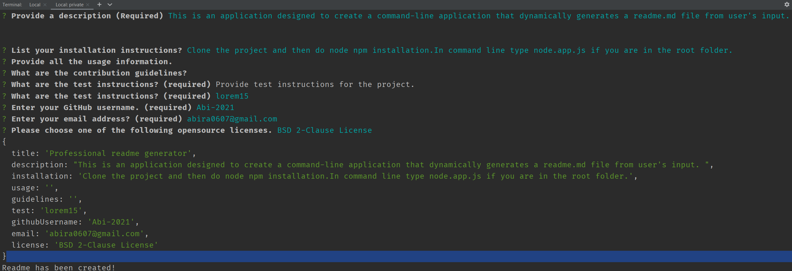
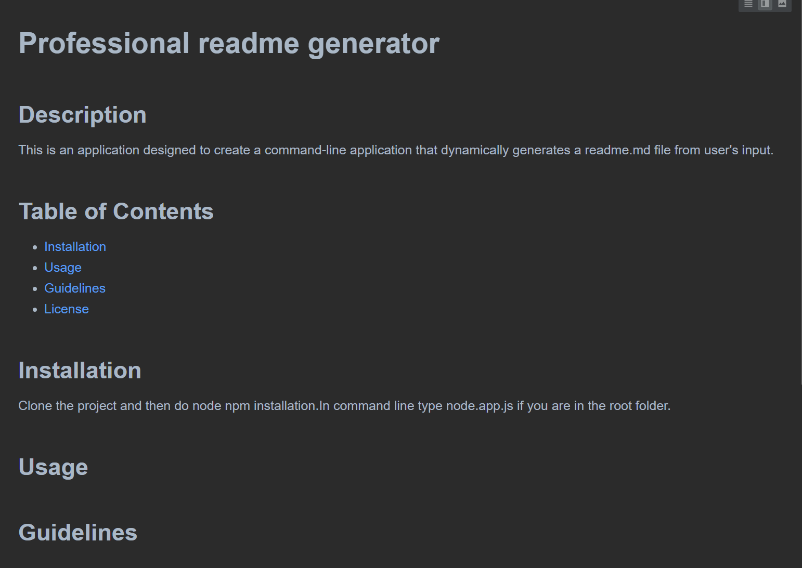

# Professional README.md Generator

## Description

This is an application designed to create a command-line application that dynamically generates a professional README.md file from  user's input using the Inquirer package.

## Table of contents

* [Installation](#installation)
* [Screenshot](#screenshot)
* [Contact](#contact)

## Installation

Node.js is required to run this application. All the dependencies can be installed by typing 'node install' followed by the dependency name in the terminal while in the root directory of the application.

## Screenshot

</img>
<pre></pre>
</img>
<pre></pre>
</img>

## Contact
[GitHub](https://github.com/Abi-2021)  
[Email](abira0607@gmail.com)

